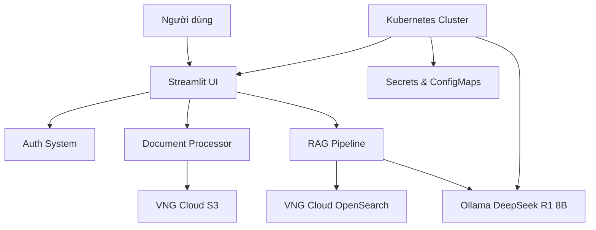

# 🤖 RAG Assistant - Hệ Thống Hỏi Đáp Thông Minh với VNG Cloud

**RAG Assistant** là một hệ thống hỏi đáp thông minh doanh nghiệp được xây dựng với kiến trúc Retrieval-Augmented Generation (RAG), tích hợp các công nghệ tiên tiến bao gồm VNG Cloud OpenSearch, Ollama DeepSeek R1 8B, và VNG Cloud S3 Storage.

## **✨ Tính Năng Chính**

**🔐 Hệ Thống Xác Thực Bảo Mật:**
- Đăng nhập với session management và timeout tự động (8 giờ)
- Phân quyền Admin/User với rate limiting chống brute force
- Quản lý người dùng qua Kubernetes Secret hoặc environment variables

**📄 Xử Lý Tài Liệu Đa Dạng:**
- Hỗ trợ định dạng: PDF, DOCX, TXT (tối đa 50MB)
- Tự động phát hiện loại tài liệu (học thuật, pháp lý, kinh doanh)
- Smart chunking với overlap tối ưu cho RAG
- Fallback strategies cho các thư viện xử lý tài liệu

**🤖 AI Thông Minh Multi-Strategy:**
- **RAG thuần:** Trả lời dựa trên tài liệu chất lượng cao
- **Hybrid approach:** Kết hợp tài liệu + kiến thức chung
- **General knowledge:** Sử dụng kiến thức chung khi không có tài liệu liên quan
- Embedding với SentenceTransformers all-MiniLM-L6-v2

**☁️ Tích Hợp VNG Cloud:**
- **Vector Database:** VNG Cloud OpenSearch cho semantic search
- **File Storage:** VNG Cloud S3 (vStorage) cho quản lý tài liệu
- **Kubernetes-ready:** ConfigMap, Secret, và Health Check

## **🏗️ Kiến Trúc Hệ Thống**



## **⚙️ Yêu Cầu Hệ Thống**

**Môi Trường Phát Triển:**
- Python 3.9+
- Docker & Docker Compose
- Kubernetes cluster với kubectl
- Git

**Dịch Vụ VNG Cloud:**
- OpenSearch instance đã cấu hình
- S3 bucket với access credentials
- Network connectivity từ K8s cluster

**Tài Nguyên Tối Thiểu:**
- **Streamlit App:** 2 CPU cores, 4GB RAM
- **Ollama:** 4 CPU cores, 8GB RAM, 20GB storage
- **Network:** Stable internet connection

## **🚀 Cài Đặt và Triển Khai**

### **Bước 1: Chuẩn Bị Môi Trường**

**Clone Repository:**
```bash
git clone <repository-url>
cd rag-assistant
```

**Tạo Virtual Environment:**
```bash
python -m venv venv
source venv/bin/activate  # Linux/Mac
# hoặc
venv\Scripts\activate     # Windows
```

**Cài Đặt Dependencies:**
```bash
pip install -r requirements.txt
```

### **Bước 2: Cấu Hình Environment Variables**

**Tạo file `.env`:**
```bash
# OpenSearch Configuration
OPENSEARCH_URL=https://phuongtra-93356-9qzuu-hcm03.vdb-opensearch.vngcloud.vn:9200
OPENSEARCH_USER=master-user
OPENSEARCH_PASS=XXXXXXX
OPENSEARCH_INDEX=phuongtra

# Ollama Configuration với DeepSeek R1 8B
OLLAMA_URL=http://localhost:11434
OLLAMA_MODEL=deepseek-r1:8b

# Embedding Model
EMBEDDING_MODEL=sentence-transformers/all-MiniLM-L6-v2
EMBEDDING_DIM=384

# RAG Settings
RAG_TOP_K=5

# Document Processing
chunk_size=1000
chunk_overlap=200

# VNG Cloud S3 Configuration
S3_ENDPOINT_URL=https://hcm03.vstorage.vngcloud.vn
S3_BUCKET_NAME=ai-data
AWS_ACCESS_KEY_ID=your-access-key
AWS_SECRET_ACCESS_KEY=your-secret-key
AWS_DEFAULT_REGION=hcm03

# Authentication Users
STREAMLIT_USERS={"admin":"admin123","phuongtra":"phuongtra789"}
```

### **Bước 3: Cài Đặt Ollama với DeepSeek R1 8B**

**Cài đặt Ollama:**
```bash
# Cài đặt Ollama
curl -fsSL https://ollama.ai/install.sh | sh

# Hoặc sử dụng Docker
docker run -d -v ollama:/root/.ollama -p 11434:11434 --name ollama ollama/ollama
```

**Pull DeepSeek R1 8B Model:**
```bash
# Local installation
ollama pull deepseek-r1:8b

# Docker installation
docker exec -it ollama ollama pull deepseek-r1:8b

# Verify model
ollama list
```

### **Bước 4: Test Ứng Dụng Local**

**Chạy Streamlit App:**
```bash
streamlit run main.py --server.port 8501
```

**Kiểm Tra Kết Nối:**
- Truy cập: `http://localhost:8501`
- Đăng nhập với: `admin/admin123`
- Upload file test và thử hỏi đáp

### **Bước 5: Build Docker Image**

**Tạo Dockerfile:**
```dockerfile
FROM python:3.10-slim

WORKDIR /app

# Install system dependencies
RUN apt-get update && apt-get install -y \
    build-essential \
    curl \
    && rm -rf /var/lib/apt/lists/*

# Copy requirements and install Python dependencies
COPY requirements.txt .
RUN pip install --no-cache-dir -r requirements.txt

# Copy application code
COPY . .

# Expose port
EXPOSE 8501

# Health check
HEALTHCHECK CMD curl --fail http://localhost:8501/_stcore/health || exit 1

# Run application
CMD ["streamlit", "run", "main.py", "--server.port=8501", "--server.address=0.0.0.0"]
```

**Build và Push Image:**
```bash
# Build image
docker build -t your-registry/rag-assistant:latest .

# Test locally
docker run -p 8501:8501 --env-file .env your-registry/rag-assistant:latest

# Push to registry
docker push your-registry/rag-assistant:latest
```

## **☸️ Deploy trên Kubernetes**

### **Bước 1: Tạo Namespace**

```yaml
# k8s/namespace.yaml
apiVersion: v1
kind: Namespace
metadata:
  name: rag-system
```

### **Bước 2: Tạo Secrets**

```yaml
# k8s/secrets.yaml
apiVersion: v1
kind: Secret
metadata:
  name: rag-secrets
  namespace: rag-system
type: Opaque
stringData:
  # OpenSearch Credentials
  OPENSEARCH_USER: "master-user"
  OPENSEARCH_PASS: "XXXXXXXX"
  
  # VNG Cloud S3 Credentials
  AWS_ACCESS_KEY_ID: "your-access-key"
  AWS_SECRET_ACCESS_KEY: "your-secret-key"
  
  # User Authentication
  STREAMLIT_USERS: '{"admin":"admin123","phuongtra":"phuongtra789"}'
```

### **Bước 3: Tạo ConfigMap**

```yaml
# k8s/configmap.yaml
apiVersion: v1
kind: ConfigMap
metadata:
  name: rag-config
  namespace: rag-system
data:
  # OpenSearch Configuration
  OPENSEARCH_URL: "https://phuongtra-93356-9qzuu-hcm03.vdb-opensearch.vngcloud.vn:9200"
  OPENSEARCH_INDEX: "phuongtra"
  
  # Ollama Configuration
  OLLAMA_URL: "http://ollama-service.rag-system.svc.cluster.local:11434"
  OLLAMA_MODEL: "deepseek-r1:8b"
  
  # Embedding Configuration
  EMBEDDING_MODEL: "sentence-transformers/all-MiniLM-L6-v2"
  EMBEDDING_DIM: "384"
  
  # RAG Settings
  RAG_TOP_K: "5"
  chunk_size: "1000"
  chunk_overlap: "200"
  
  # VNG Cloud S3 Configuration
  S3_ENDPOINT_URL: "https://hcm03.vstorage.vngcloud.vn"
  S3_BUCKET_NAME: "ai-data"
  AWS_DEFAULT_REGION: "hcm03"
```

### **Bước 4: Deploy Ollama với DeepSeek R1 8B**

**PersistentVolumeClaim:**
```yaml
# k8s/ollama-pvc.yaml
apiVersion: v1
kind: PersistentVolumeClaim
metadata:
  name: ollama-pvc
  namespace: rag-system
spec:
  accessModes:
    - ReadWriteOnce
  resources:
    requests:
      storage: 25Gi  # DeepSeek R1 8B cần ~8GB + buffer
  storageClassName: standard
```

**Ollama Deployment:**
```yaml
# k8s/ollama-deployment.yaml
apiVersion: apps/v1
kind: Deployment
metadata:
  name: ollama-deployment
  namespace: rag-system
spec:
  replicas: 1
  selector:
    matchLabels:
      app: ollama
  template:
    metadata:
      labels:
        app: ollama
    spec:
      initContainers:
      - name: pull-model
        image: ollama/ollama:latest
        command: 
          - /bin/bash
          - -c
          - |
            ollama serve &
            sleep 10
            ollama pull deepseek-r1:8b
            pkill ollama
        volumeMounts:
        - name: ollama-data
          mountPath: /root/.ollama
        env:
        - name: OLLAMA_HOST
          value: "0.0.0.0"
      containers:
      - name: ollama
        image: ollama/ollama:latest
        ports:
        - containerPort: 11434
        env:
        - name: OLLAMA_HOST
          value: "0.0.0.0"
        volumeMounts:
        - name: ollama-data
          mountPath: /root/.ollama
        resources:
          requests:
            memory: "4Gi"
            cpu: "2000m"
          limits:
            memory: "8Gi"
            cpu: "4000m"
        livenessProbe:
          httpGet:
            path: /api/tags
            port: 11434
          initialDelaySeconds: 60
          periodSeconds: 30
        readinessProbe:
          httpGet:
            path: /api/tags
            port: 11434
          initialDelaySeconds: 30
          periodSeconds: 10
      volumes:
      - name: ollama-data
        persistentVolumeClaim:
          claimName: ollama-pvc
```

**Ollama Service:**
```yaml
# k8s/ollama-service.yaml
apiVersion: v1
kind: Service
metadata:
  name: ollama-service
  namespace: rag-system
spec:
  selector:
    app: ollama
  ports:
    - protocol: TCP
      port: 11434
      targetPort: 11434
  type: ClusterIP
```

### **Bước 5: Deploy RAG Assistant**

**Deployment:**
```yaml
# k8s/rag-deployment.yaml
apiVersion: apps/v1
kind: Deployment
metadata:
  name: rag-assistant
  namespace: rag-system
spec:
  replicas: 2
  selector:
    matchLabels:
      app: rag-assistant
  template:
    metadata:
      labels:
        app: rag-assistant
    spec:
      containers:
      - name: rag-assistant
        image: your-registry/rag-assistant:latest
        ports:
        - containerPort: 8501
        envFrom:
        - configMapRef:
            name: rag-config
        - secretRef:
            name: rag-secrets
        resources:
          requests:
            memory: "2Gi"
            cpu: "1000m"
          limits:
            memory: "4Gi"
            cpu: "2000m"
        livenessProbe:
          httpGet:
            path: /_stcore/health
            port: 8501
          initialDelaySeconds: 30
          periodSeconds: 10
        readinessProbe:
          httpGet:
            path: /_stcore/health
            port: 8501
          initialDelaySeconds: 10
          periodSeconds: 5
```

**Service:**
```yaml
# k8s/rag-service.yaml
apiVersion: v1
kind: Service
metadata:
  name: rag-assistant-service
  namespace: rag-system
spec:
  selector:
    app: rag-assistant
  ports:
    - protocol: TCP
      port: 80
      targetPort: 8501
  type: LoadBalancer  # hoặc NodePort, ClusterIP + Ingress
```

**Ingress (Tùy chọn):**
```yaml
# k8s/ingress.yaml
apiVersion: networking.k8s.io/v1
kind: Ingress
metadata:
  name: rag-assistant-ingress
  namespace: rag-system
  annotations:
    nginx.ingress.kubernetes.io/rewrite-target: /
spec:
  rules:
  - host: rag-assistant.your-domain.com
    http:
      paths:
      - path: /
        pathType: Prefix
        backend:
          service:
            name: rag-assistant-service
            port:
              number: 80
```

### **Bước 6: Deploy All Resources**

```bash
# Apply tất cả resources theo thứ tự
kubectl apply -f k8s/namespace.yaml
kubectl apply -f k8s/secrets.yaml
kubectl apply -f k8s/configmap.yaml

# Deploy Ollama
kubectl apply -f k8s/ollama-pvc.yaml
kubectl apply -f k8s/ollama-deployment.yaml
kubectl apply -f k8s/ollama-service.yaml

# Đợi Ollama ready
kubectl wait --for=condition=ready pod -l app=ollama -n rag-system --timeout=300s

# Deploy RAG Assistant
kubectl apply -f k8s/rag-deployment.yaml
kubectl apply -f k8s/rag-service.yaml
kubectl apply -f k8s/ingress.yaml  # nếu sử dụng
```

## **📋 Sử Dụng Hệ Thống**

### **Đăng Nhập**
1. Truy cập URL của ứng dụng
2. Sử dụng tài khoản mặc định:
   - **Admin:** `admin/admin123`
   - **User:** `phuongtra/phuongtra789`

### **Quản Lý Tài Liệu**
1. **Upload Local:** Chọn file PDF/DOCX/TXT từ máy tính
2. **VNG Cloud S3:** Duyệt và chọn file từ S3 bucket
3. Hệ thống tự động xử lý và tạo embeddings

### **Hỏi Đáp Thông Minh**
1. Nhập câu hỏi vào chat interface
2. Hệ thống sẽ:
   - Tìm kiếm semantic trong tài liệu
   - Chọn strategy phù hợp (RAG/Hybrid/General)
   - Tạo câu trả lời với nguồn tham khảo

## **🔍 Monitoring và Troubleshooting**

### **Health Checks**
```bash
# Kiểm tra pods
kubectl get pods -n rag-system

# Xem logs
kubectl logs -f deployment/rag-assistant -n rag-system
kubectl logs -f deployment/ollama-deployment -n rag-system

# Kiểm tra services
kubectl get svc -n rag-system

# Test Ollama API
kubectl exec -it deployment/rag-assistant -n rag-system -- curl http://ollama-service:11434/api/tags
```

### **Common Issues và Solutions**

**Ollama Model Loading Issues:**
```bash
# Kiểm tra model đã được pull chưa
kubectl exec -it deployment/ollama-deployment -n rag-system -- ollama list

# Re-pull model nếu cần
kubectl exec -it deployment/ollama-deployment -n rag-system -- ollama pull deepseek-r1:8b
```

**OpenSearch Connection Issues:**
```bash
# Test connectivity
kubectl exec -it deployment/rag-assistant -n rag-system -- curl -v https://phuongtra-93356-9qzuu-hcm03.vdb-opensearch.vngcloud.vn:9200
```

**Memory Issues:**
```bash
# Tăng resource limits
kubectl patch deployment rag-assistant -n rag-system -p '{"spec":{"template":{"spec":{"containers":[{"name":"rag-assistant","resources":{"limits":{"memory":"8Gi","cpu":"4000m"}}}]}}}}'
```

### **Performance Tuning**

**Scaling:**
```bash
# Manual scaling
kubectl scale deployment rag-assistant --replicas=5 -n rag-system

# Auto scaling
kubectl autoscale deployment rag-assistant --cpu-percent=70 --min=2 --max=10 -n rag-system
```

**Resource Optimization:**
- Điều chỉnh `chunk_size` và `chunk_overlap` trong ConfigMap
- Tối ưu `RAG_TOP_K` dựa trên quality/performance trade-off
- Monitor memory usage và adjust limits

## **🔒 Security Best Practices**

**Secrets Management:**
- Sử dụng Kubernetes Secrets cho sensitive data
- Định kỳ rotate credentials
- Implement proper RBAC

**Network Security:**
- Sử dụng NetworkPolicies để restrict traffic
- Enable TLS/SSL cho tất cả endpoints
- Implement proper Ingress security

**Monitoring và Auditing:**
```bash
# Monitor access logs
kubectl logs -f deployment/rag-assistant -n rag-system | grep "login\|auth"

# Resource monitoring
kubectl top pods -n rag-system
kubectl top nodes
```

## **📊 Backup và Recovery**

**Backup OpenSearch Data:**
```bash
# Tạo snapshot repository (nếu chưa có)
curl -X PUT "https://your-opensearch-endpoint/_snapshot/backup_repo" -H 'Content-Type: application/json' -d'
{
  "type": "s3",
  "settings": {
    "bucket": "your-backup-bucket",
    "region": "hcm03",
    "base_path": "opensearch-snapshots"
  }
}'

# Tạo snapshot
curl -X PUT "https://your-opensearch-endpoint/_snapshot/backup_repo/snapshot_$(date +%Y%m%d_%H%M%S)"
```

**Backup Kubernetes Configs:**
```bash
kubectl get all,configmap,secret -n rag-system -o yaml > rag-system-backup.yaml
```

## **🔧 Cấu Trúc Project**

```
rag-assistant/
├── auth.py                 # Hệ thống xác thực
├── config.py              # Cấu hình chung
├── document_processor.py  # Xử lý tài liệu
├── main.py               # Streamlit app chính
├── rag_pipeline.py       # Logic RAG
├── requirements.txt      # Python dependencies
├── s3_client.py         # VNG Cloud S3 client
├── vector_db.py         # OpenSearch client
├── Dockerfile           # Docker build
└── k8s/                 # Kubernetes manifests
    ├── namespace.yaml
    ├── secrets.yaml
    ├── configmap.yaml
    ├── ollama-pvc.yaml
    ├── ollama-deployment.yaml
    ├── ollama-service.yaml
    ├── rag-deployment.yaml
    ├── rag-service.yaml
    └── ingress.yaml
```

## **🎯 Next Steps và Mở Rộng**

**Tích Hợp Nâng Cao:**
- LDAP/SSO authentication
- Multi-tenant support
- Advanced RAG techniques (re-ranking, query expansion)

**Monitoring và Observability:**
- Prometheus metrics
- Grafana dashboards
- Distributed tracing

**Performance Optimization:**
- Model quantization
- Caching strategies
- Load balancing optimization

---

**📞 Hỗ Trợ và Liên Hệ**

- **Documentation:** [Internal Wiki/Docs]
- **Issues:** [GitHub Issues]
- **Support:** [Internal Support Channel]

**🏷️ Version:** RAG Assistant v2.0  
**🔒 Security:** Enterprise-grade with VNG Cloud Integration  
**⚡ Performance:** Optimized for DeepSeek R1 8B Model